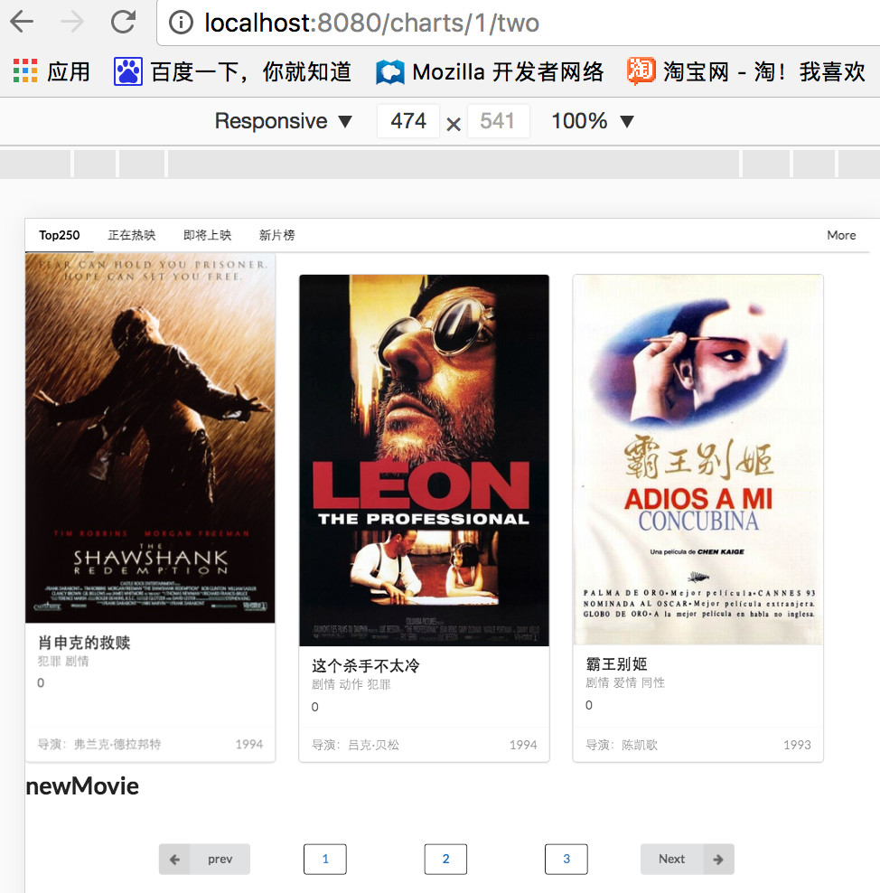

### 前言

最近练习Vue，看到官方文档中的[嵌套路由](https://router.vuejs.org/zh-cn/essentials/nested-routes.html)，
不做不知道，实在是太坑了，网上资料demo少之又少，然后自己就做了一个demo,用了vue2.0嵌套路由实现豆瓣电影分页功能，供大家学习学习，写得不好望见谅。

官方文档给出的demo：[http://jsfiddle.net/yyx990803/L7hscd8h/](http://jsfiddle.net/yyx990803/L7hscd8h/)

### Demo简单介绍
主路由：Top250(charts)，正在热映(hot)，即将上映(ing)，新片榜(newmovie)
	
	const router = new VueRouter({
		routes: [
		    {
		      path: '/',   //设置默认路由为Top250
		      component: charts
		    },
		    {
		      path: '/charts',  //Top250
		      component: charts
		    },
		    {
		      path: '/hot', 
		      component: hot
		    },
		    {
		      path: '/ing',
		      component: ing
		    },
		    {
		      path: '/newmovie',
		      component: newmovie
		    },
	    ]
	 }
在top250(charts)上添加了分页功能作为子路由，在配置上添加：

	{
      path: '/charts/:id',  //子路由
      component: charts,
      children: [
        {path: 'one', component: ing},
        {path: 'two', component: newmovie},
        {path: 'three', component: test}
        ]
    }
    
在charts组件上添加入口:

	<router-link to="/charts/1/one">1</router-link>
	<router-link to="/charts/1/two">2</router-link>
	<router-link to="/charts/1/three">3</router-link>

在charts组件上添加出口:

	<router-view></router-view>
    
#### 遇见的坑

	<router-link to="/charts/1/one"></router-link>
一定要加上这个1,对应→path: '/charts/:id'中的指定id，缺少id是不行的，官方文档有介绍：[动态路由配置](https://router.vuejs.org/zh-cn/essentials/dynamic-matching.html)
 
demo截图：

分页2：

	
跳到正在热映：


demo地址：[https://github.com/liangxiaoxin/doubandemo](https://github.com/liangxiaoxin/doubandemo)

数据来自[豆瓣电影API](https://developers.douban.com/wiki/?title=movie_v2)。

代码写得好烂，凑合着看吧，反正子路由还是成功的啊！哈哈哈


## Build Setup

``` bash
# install dependencies
npm install

# serve with hot reload at localhost:8080
npm run dev

# build for production with minification
npm run build
```


